# ESP32 Token Display

แสดงผล API usage จาก **OpenRouter**, **Anthropic**, และ **Claude.ai** บน ESP32 ที่มีจอ ST7789 1.9" ในตัว  
กด BOOT button เพื่อสลับหน้าแสดงผล

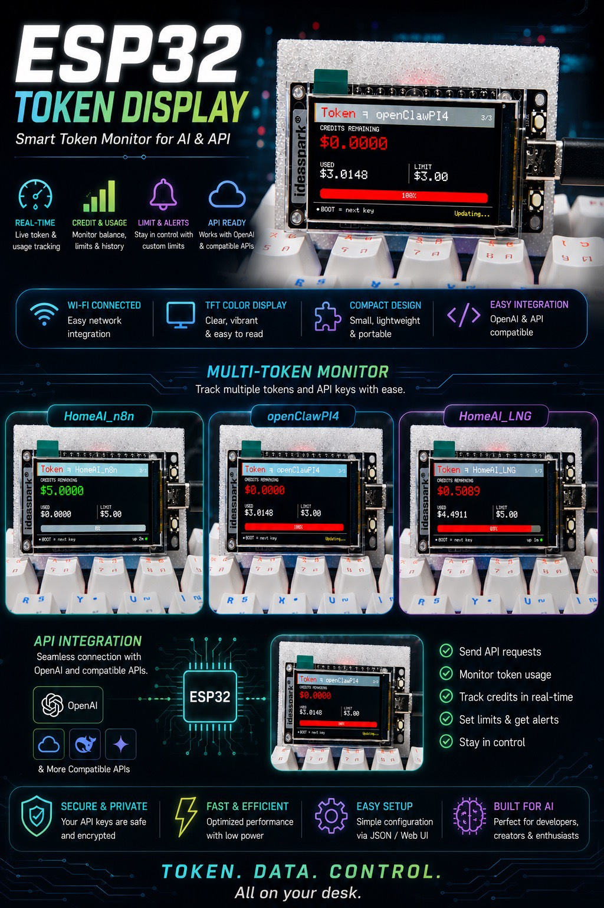

---

## Features

- แสดง Credits / Usage / Limit จาก **OpenRouter API**
- แสดง Rate Limits (Tokens, Requests, Input, Output) จาก **Anthropic API**
- แสดง Session (5h) และ Weekly (7d) usage จาก **Claude.ai** ผ่าน relay server
- สลับระหว่าง API Keys และหน้า relay ด้วย **BOOT Button (GPIO 0)**
- อัปเดตอัตโนมัติทุก 30 วินาที
- Auto-switch ไปหน้า Claude.ai ทันทีที่ relay server เริ่มทำงาน
- ตั้งค่าทุกอย่างผ่าน **VSCode Extension** — ไม่ต้องแก้ไขไฟล์เอง

---

## Hardware

รองรับ 3 บอร์ดหลักในโปรเจกต์นี้ โดยแต่ละรุ่นใช้ environment คนละตัวใน `platformio.ini`

### 1) ESP32 All-in-One ST7789 1.9" (`env:esp32dev`)

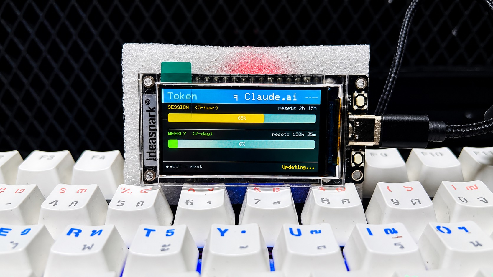

| คุณสมบัติจำเป็น | ค่า |
|----------------|-----|
| MCU | ESP32 (Xtensa LX6 dual-core 240 MHz) |
| Display | ST7789 1.9" 170×320 (landscape 320×170) |
| Library จอ | TFT_eSPI |
| ปุ่มสลับหน้า | BOOT (GPIO 0) |
| Backlight | Active HIGH (`TFT_BACKLIGHT_ON=1`) |

| Signal | GPIO |
|--------|------|
| MOSI | 23 |
| SCLK | 18 |
| CS | 15 |
| DC | 2 |
| RST | 4 |
| BL | 32 |

### 2) TTGO T-Display (`env:ttgo-t-display`)

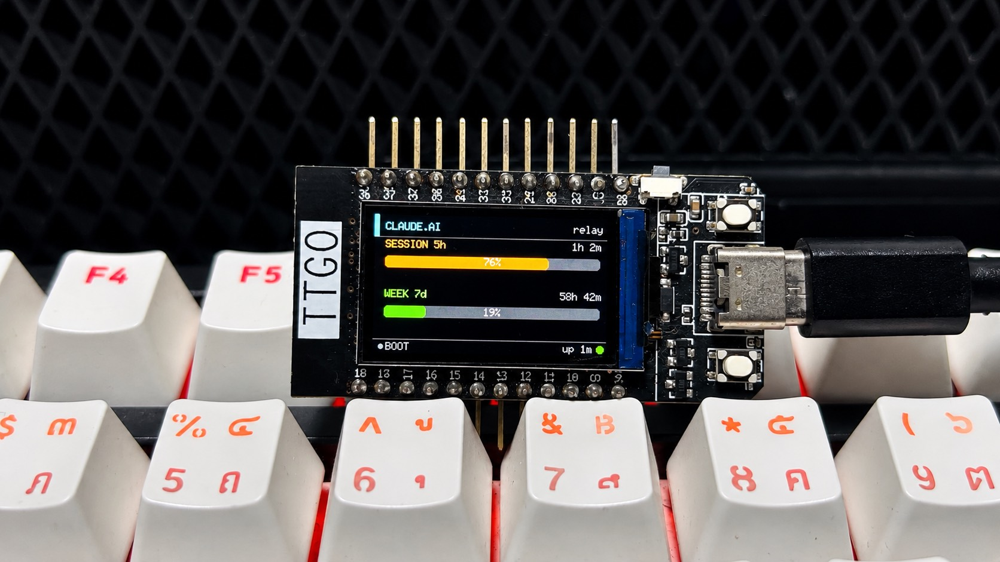

| คุณสมบัติจำเป็น | ค่า |
|----------------|-----|
| MCU | ESP32 |
| Display | ST7789 1.14" 135×240 (landscape 240×135) |
| Library จอ | TFT_eSPI |
| ปุ่มสลับหน้า | BOOT (GPIO 0) |
| ปุ่มเสริม | BTN2 (GPIO 35, ปัจจุบันยังไม่ใช้) |
| Backlight | Active HIGH (`TFT_BACKLIGHT_ON=1`) |

| Signal | GPIO |
|--------|------|
| MOSI | 19 |
| SCLK | 18 |
| CS | 5 |
| DC | 16 |
| RST | 23 |
| BL | 4 |

### 3) Waveshare ESP32-S3-Touch-LCD-1.9 (`env:esp32s3-touch-lcd-1_9`)

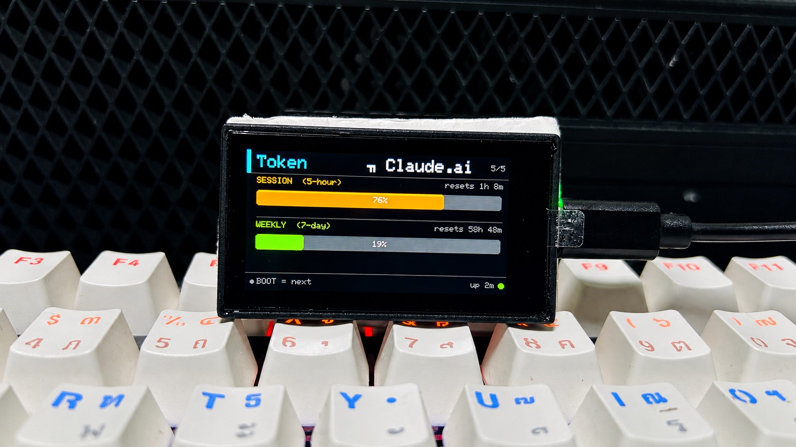

| คุณสมบัติจำเป็น | ค่า |
|----------------|-----|
| MCU | ESP32-S3R8 |
| Flash / PSRAM | 16MB Flash + 8MB Octal PSRAM |
| Memory mode | ต้องเป็น `qio_opi` |
| Display | ST7789 1.9" 170×320 |
| Library จอ | Arduino_GFX (ไม่ใช้ TFT_eSPI บนบอร์ดนี้) |
| Touch IC | CST816 (I2C addr `0x15`) |
| Touch pins | SDA=47, SCL=48 |
| ปุ่มสลับหน้า | แตะจอ (ทดแทน BOOT button) |
| Backlight | GPIO 14, Active LOW |

---

## File Structure

```
ESP32-Token-Display/
├── include/
│   ├── config.h            ← WiFi, API Keys, Relay Host (แก้ผ่าน extension)
│   ├── config.h.example    ← template สำหรับ config.h
│   ├── AnthropicAPI.h      ← fetch rate limits จาก Anthropic
│   ├── OpenRouterAPI.h     ← fetch credits จาก OpenRouter
│   ├── RelayAPI.h          ← fetch usage จาก relay server
│   └── DisplayUI.h         ← render หน้าจอทั้งหมด
├── src/
│   └── main.cpp
├── server/
│   ├── relay.py            ← relay server (รันบน PC)
│   └── .env                ← Claude.ai credentials (ไม่ commit)
├── poc/                    ← scripts ทดสอบ API
│   ├── poc_claude_api.py
│   ├── poc_claudeai_usage.py
│   └── ...
└── vscode-extension/       ← ESP32 Token Display Config extension
```

---

## Display Pages

BOOT button วนหน้าจอตามลำดับ: **Key 1 → Key 2 → ... → Claude.ai → Key 1**

### OpenRouter (credits)
แสดง Credits remaining, Used, Limit พร้อม progress bar

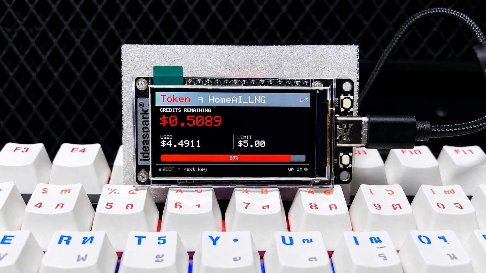

### Anthropic (rate limits)
แสดง Tokens/min, Requests/min, Input tokens, Output tokens พร้อม reset timer

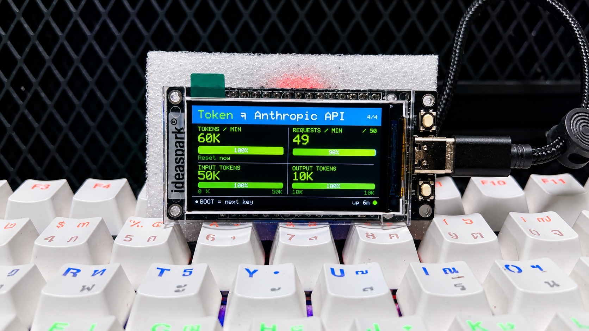

### Claude.ai Relay
แสดง Session usage (5 ชั่วโมง) และ Weekly usage (7 วัน) พร้อมเวลา reset  
หน้าจะ switch อัตโนมัติเมื่อ relay server เพิ่งเริ่มทำงาน


---

## Setup

### 1. ติดตั้ง Extension

ติดตั้ง **ESP32 Token Display Config** extension ใน VS Code (ไฟล์ `.vsix` ใน `vscode-extension/`)

```
Extensions → ··· → Install from VSIX → เลือก esp32-token-display-1.0.0.vsix
```

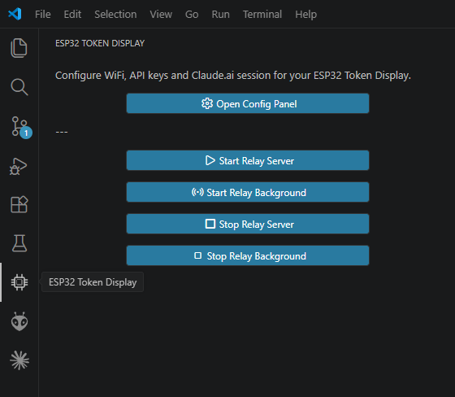

### 2. ตั้งค่าผ่าน Extension

เปิด Command Palette → `ESP32 Token Display: Open Config`

**Tab: Device**
- ใส่ WiFi SSID และ Password
- เลือก COM Port ของ ESP32
- เลือก **Display Theme** (🌑 Dark / ☀️ Light / 🎨 Vivid) — ดูรายละเอียดด้านล่าง

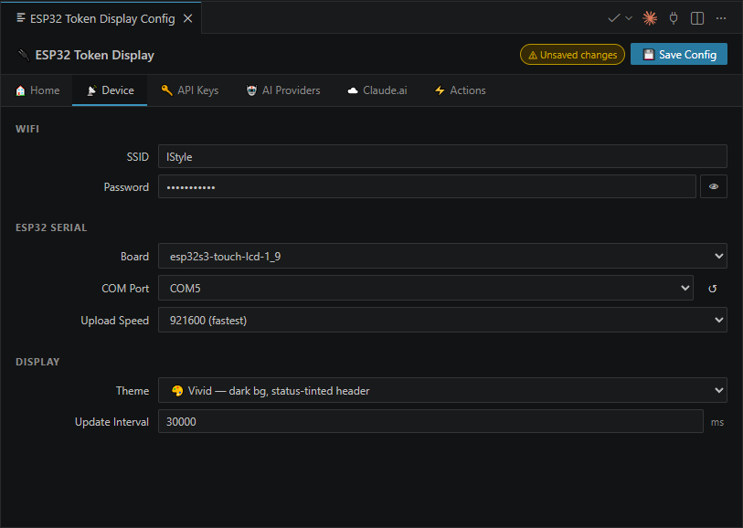

**Theme options**

| Theme | ลักษณะ | เหมาะกับ |
|-------|--------|---------|
| 🌑 **Dark** (default) | พื้นดำ ตัวอักษรขาว/เทาสว่าง | ห้องปกติ / กลางคืน |
| ☀️ **Light** | พื้นขาว ตัวอักษรดำ | ห้องที่แสงจัด / กลางวันแดด |
| 🎨 **Vivid** | พื้นดำ + แถบ header เปลี่ยนสีตามสถานะ (เขียว/ส้ม/แดง) | อยากเห็นสถานะแบบเด่นชัด |

เปลี่ยน theme → กด **💾 Save Config** → **⚡ Build & Flash** (ต้อง rebuild firmware เพราะ theme เป็น compile-time)

**Tab: API Keys**
- เพิ่ม OpenRouter keys (`sk-or-v1-...`)
- เพิ่ม Anthropic key (`sk-ant-api03-...`) — เลือก Type: Anthropic

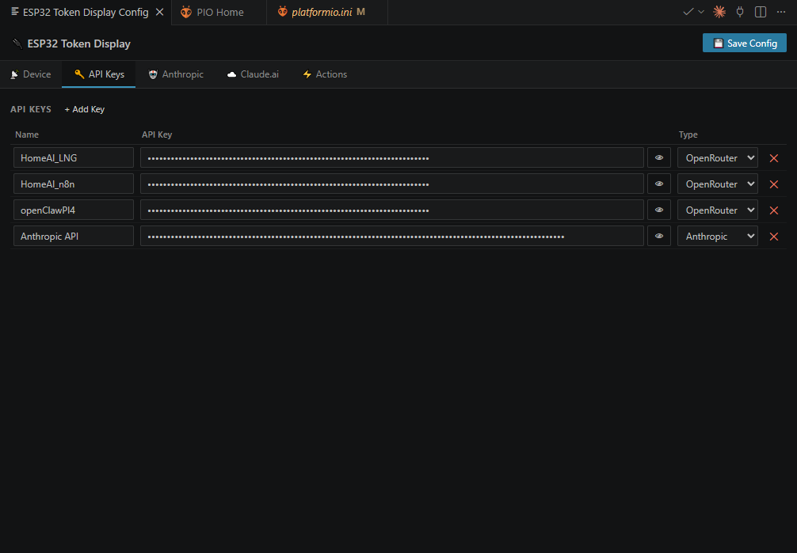

**Tab: Claude.ai**
- ใส่ Session Key และ Org ID (ดูวิธีได้จากหน้า info ใน extension)
- ใส่ PC IP (Host) — extension จะตรวจหาให้อัตโนมัติ
- กด **💾 Save Config** เพื่อบันทึก (เขียนลง `include/config.h` และ `server/.env`)

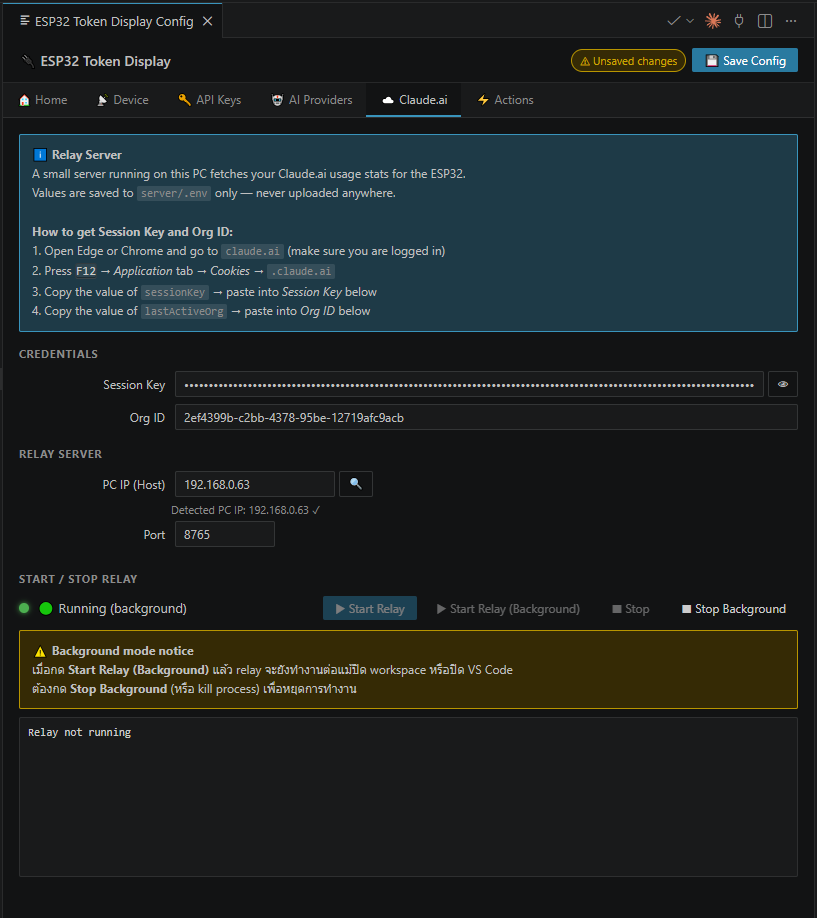

### 3. Flash ESP32

**Tab: Actions** → กด **⚡ Build & Flash**

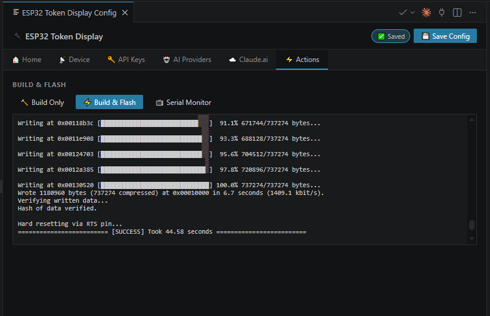

หรือใช้ PlatformIO CLI:
```bash
pio run -t upload --upload-port COM8
```

### 4. เริ่ม Relay Server (สำหรับ Claude.ai)

**บน Windows:**

ต้องการ Python + dependencies:
```bash
pip install curl_cffi python-dotenv
```

**Tab: Actions** → กด **▶ Start Relay**

หรือรันเอง:
```bash
cd server
python relay.py
```

Relay server จะรันบน `http://localhost:8765`  
เปิดเว็บ dashboard: `http://localhost:8765`

**บน Raspberry Pi (ทำครั้งเดียว):**

Deploy ไปยัง Raspberry Pi เพื่อให้รันเป็น service:
```powershell
cd D:\git\ESP32-Token-Display\server
.\deploy-to-rpi.ps1
```

หลัง deploy แล้ว relay server จะรันอัตโนมัติตอนบูต  
เปิดเว็บ dashboard: `http://192.168.0.43:8765`

ดูคู่มือเต็ม: [server/QUICKSTART.md](server/QUICKSTART.md)

---

## Configuration Reference

### include/config.h

```cpp
// WiFi
#define WIFI_SSID     "ชื่อ_WiFi"
#define WIFI_PASSWORD "รหัสผ่าน"

// API Keys
const APIKeyConfig API_KEYS[] = {
    {"HomeAI",    "sk-or-v1-...", false},   // OpenRouter
    {"Anthropic", "sk-ant-...",   true},    // Anthropic
};

// Relay server (PC running server/relay.py)
#define RELAY_HOST "192.168.0.58"
#define RELAY_PORT 8765

// Update interval
#define UPDATE_INTERVAL 30000  // ms

// Display theme: THEME_DARK | THEME_LIGHT | THEME_VIVID
#define DISPLAY_THEME THEME_DARK
```

### server/.env

```env
CLAUDEAI_SESSION="sk-ant-sid02-..."
LASTACTIVE_ORG="xxxxxxxx-xxxx-xxxx-xxxx-xxxxxxxxxxxx"
RELAY_PORT=8765
```

ได้ค่าจาก: เปิด claude.ai → F12 → Application → Cookies → `.claude.ai`  
คัดลอก `sessionKey` และ `lastActiveOrg`

---

## Troubleshooting

**Upload ไม่ได้**  
ตรวจสอบ COM Port ใน Device Manager, ติดตั้ง CH340 driver, ลองกดปุ่ม BOOT ค้างไว้ตอน upload

**WiFi เชื่อมไม่ได้**  
ตรวจสอบ SSID/Password, ESP32 รองรับเฉพาะ 2.4 GHz

**Relay offline ขึ้นบนจอ**  
ตรวจสอบว่า `server/relay.py` กำลังรัน และ `RELAY_HOST` ตรงกับ IP ของ PC

**Anthropic แสดง API Error**  
ตรวจสอบ API key และว่า key มี rate limit tier อยู่

**Serial Monitor**  
```bash
pio device monitor --port COM8
```
หรือกดปุ่ม 📺 Serial Monitor ใน extension (Tab: Actions)

---

## Libraries

- [TFT_eSPI](https://github.com/Bodmer/TFT_eSPI) by Bodmer
- [ArduinoJson](https://arduinojson.org/) by Benoit Blanchon

---

## Disclaimer

ข้อมูลทั้งหมด (API keys, session tokens, WiFi credentials) จัดเก็บ**เฉพาะในเครื่องของคุณ** และไม่ถูกส่งไปยังเซิร์ฟเวอร์ภายนอกใดๆ นอกจาก API endpoint ที่คุณตั้งค่าไว้

ฟีเจอร์ Claude.ai relay ใช้ session key ที่ผู้ใช้กรอกเองเพื่ออ่านข้อมูล usage จาก Anthropic web interface ผู้ใช้รับผิดชอบในการปฏิบัติตาม [Anthropic Terms of Service](https://www.anthropic.com/legal/consumer-terms), [OpenRouter Terms](https://openrouter.ai/terms) และ ToS ของ third-party services อื่นๆ ที่เกี่ยวข้องด้วยตนเอง

โปรเจกต์นี้ไม่มีความเกี่ยวข้องกับ Anthropic, OpenRouter หรือ service ใดๆ ที่กล่าวถึง

## License

MIT
